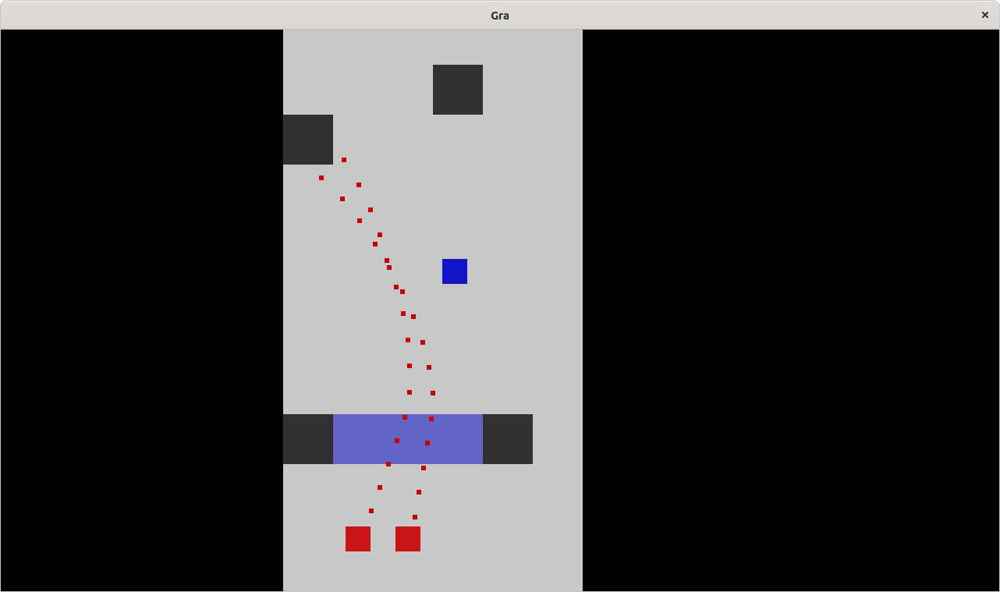

# Opis projektu

Tematem naszego projektu jest gra typu shooter 2D z widokiem z góry. Projekt korzysta
z biblioteki SDL2.

Kod projektu znajduje się na <https://github.com/gbujak/projekt-grafika>.

\vspace{1cm}

{width=70%}

\newpage

# Świat

Mapa gry jest przechowywana jako dwuwymiarowa siatka kafelków. Silnik wspiera różne
rodzaje kafelków. Są one inaczej rysowane na ekranie i elementy gry inaczej na nie
reagują.

Rodzaje kafelków, jakie do tej pory zaimplementowaliśmy to:

- Ściana (w sikniku Wall) - jest to nieprzenikalna ściana, która tworzy pokoje i
  korytarze na mapie gry. Nie przechodzą przez nie kule, ani gracz.

- Okno (w silniku Window) - jest to kafelek, przez którego można strzelać, ale nie
  można przez niego przechodzić.

- Wolna przestrzeń (w sinkiku Space) - jest to kafelek, z którego zbudowane są
  wnętrza pomieszczeń. W obrębie tych kafelków porusza się gracz. Nie zatrzymuje
  kul.
  
- Drzwi (w sinkiku Door) - Gdy gracz wejdzie na ten kafelek po pokonaniu
  przeciwników, zostanie przeniesiony na kolejne piętro poziomu.

Kafelki w silniku gry to kwadraty o wymiarach 1.0 na 1.0. Są skalowane tylko w
momencie rysowania na ekran.

# Renderer

Renderer to klasa przechowująca dane o kamerze i oknie aplikacji (`SDL_Renderer`). Ma
metody rysujące gracza, kule, świat i przeciwników na ekranie.

# Kamera

`Camera` to klasa, która przed rysowaniem każdej klatki pobiera położenie kursora
myszy w oknie aplikacji i oblicza odchylenie lewego górnego rogu ekranu od
współrzędnych 0.0, 0.0. Odchylenie jest obliczane tak, żeby kamera w każdej klatce
była wyśrodkowana pomiędzy kursorem myszy, a graczem. Domyślnie jest także bardziej
zbliżona do gracza.

Oblicza też `aim_vector`. Jest to wektor dwuwymiarowy taki, że pozycja gracza +
`aim_vector` = pozycja kursora myszy. Wektor jest używany do określenia kierunku
strzelania.

# Kolizja

Kolizja jest zaimplementowana w metodach klasy `World`. Dzięki temu, że wszystko w
silniku jest kwadratem oraz plansza jest siatką kafelków, sprawdzanie kolizji ze
światem jest bardzo proste i wydajne.

Żeby uzyskać kafelek, w jakim znajduje się kwadrat, wystarczy użyć na jego
koordynatach funkcji `std::floor`. Jeśli szerokość kafelka jest taka, że po dodaniu
jej do koordynatów otrzymamy inny kafelek, należy sprawdzić też kolizję tych
kafelków. Wykonuje to ta funkcja:

```cpp
auto World::simple_collision(Point2f position, float width, bool is_piercing) -> bool {
    auto& room = *current_room();

    bool crosses_x = std::floor(position.x) != std::floor(position.x + width);
    bool crosses_y = std::floor(position.y) != std::floor(position.y + width);

    bool result = false;

    for (int x = 0; x < 1 + (int) crosses_x; x++)
        for (int y = 0; y < 1 + (int) crosses_y; y++)
            result |= room.does_collide({position.x + x, position.y + y}, is_piercing);
    
    return result;
}
```

Takie rozwiązanie nie nadaje się do kolizji gracza ze światem, bo kolizja na jednej
osi blokowałaby ruch gracza na obydwu osiach. Do kolizji gracza ze światem służy ta
metoda:

```cpp
auto World::vector_collision(Point2f position,
                             Point2f next_position,
                             float width,
                             bool is_piercing) -> Point2f {
    Point2f result;
    
    if (simple_collision({next_position.x, position.y}, width, is_piercing))
        result.x = position.x;
    else result.x = next_position.x;

    if (simple_collision({position.x, next_position.y}, width, is_piercing))
        result.y = position.y;
    else result.y = next_position.y;

    return result;
}
```
Umożliwia to przesuwanie się gracza wzdłuż ściany, gdy ten porusza się po
skosie.

```cpp
class Weapon {
    unsigned bullet_per_shot;
    unsigned bullet_velocity;
    unsigned recovery_time;
    unsigned inaccuracy_time;
    unsigned base_spread;
    unsigned last_shot;

    BulletSystem& m_bullet_system;

    public: 
    Weapon(unsigned bullet_per_shot, unsigned bullet_velocity,
           unsigned recovery_time,   unsigned innacuracy_time,
           unsigned base_spread,     BulletSystem& bullet_system);
    
    auto try_shoot(Point2f position, Point2f aim_vector, unsigned tick) -> void;
};
```

Implementacja medoty try_shoot: (zdążyliśmy zaimplementować tylko prędkość kuli
i szybkostrzelność broni)

```cpp
auto Weapon::try_shoot(Point2f position, Point2f aim_vector, unsigned tick) -> void {
    aim_vector.normalize();
    auto tick_diff = tick - last_shot;
    if (tick_diff < recovery_time) return;

    for (unsigned i = 0; i < bullet_per_shot; i++) {
        auto velocity_vector = aim_vector;
        velocity_vector.mul_scalar(bullet_velocity);

        auto vel_normalized = velocity_vector.normalized();
        vel_normalized.mul_scalar(PERSON_WIDTH);
        position.add_point2f(vel_normalized);

        auto bullet = Bullet {position, velocity_vector, tick};
        m_bullet_system.add_bullet(bullet);
    }

    last_shot = tick;
}
```

# Przeciwnicy

```cpp
class Enemy {
    Weapon m_weapon;
    Point2f m_position;

    public:
    Enemy(Weapon weapon, Point2f position);

    bool can_see(Point2f target, Floor& floor);
    void shoot_if_visible(Point2f target, Floor& floor, unsigned tick);
    void update(unsigned tick, Point2f player_position, Floor& floor);

    Point2f position() { return m_position; }
};
```

Przeciwnik zawiera obiekt klasy Weapon tak samo, jak gracz, czyli bez trudności
można zmieniać parametry broni.

## Sprawdzenie, czy przeciwnik widzi gracza

```cpp
bool Enemy::can_see(Point2f target, Floor& floor) {
    target.add_scalar(0.5f * PERSON_WIDTH);

    if ((m_position - target).length() > 8.0f) return false;

    auto point = m_position;
    auto step = (target - m_position).normalized();
    step.mul_scalar(0.5f);
    point.add_point2f(step);

    while ((m_position - point).length() < (m_position - target).length()) {
        if (floor.does_collide(point, true)) return false;
        point.add_point2f(step);
    }

    return true;
}

void Enemy::shoot_if_visible(Point2f target, Floor& floor, unsigned tick) {
    if (can_see(target, floor))
        m_weapon.try_shoot(m_position, target - m_position, tick);
}

void Enemy::update(unsigned tick, Point2f player_position, Floor& floor) {
    this->shoot_if_visible(player_position, floor, tick);
}
```

Sprawdzanie widoczności gracza odbywa się na podstawie algorytmu raycasting.
Tworzony jest promień wychodzący od przeciwnika i skierowany w stronę gracza.
Promień jest normalizowany i mnożony przez dokładność badania (tutaj 0.5). Gdy
badany punkt jest bardziej odległy od przeciwnika, niż gracz, oznacza to, że
gracz jest widoczny i przeciwnik zacznie strzelać w stronę gracza.

# Restart poziomu po śmierci gracza

Restart poziomu jest implementowany w kilku metodach:

## W klasie Player

```cpp
auto Player::update(const InputState* input_state, Point2f aim_vector, Uint32 tick) -> void {
    if (m_dead) {
        if (input_state->keyboard_state[SDL_SCANCODE_R]) {
            m_position = m_world.reload_floor();
            m_speed.mul_scalar(0.0f);
            m_dead = false;
        } else return;
    }    

    // Pominięty kod, gdy gracz żyje...
}
```

## W klasie World

```cpp
auto World::reload_floor() -> Point2f {

    m_bullet_system.bullets().clear();
    m_enemies.clear();

    for (auto position : current_room()->initial_enemy_positions()) {
        auto enemy = Enemy{ Weapon{1, 10, 50, 0, 0, bullet_system()}, position };
        m_enemies.push_back(enemy);
    }

    return current_room()->initial_player_position();
}
```

# Budowa poziomów

Nie zdążyliśmy zaprojektować edytora poziomów, ale poziom to lista kafelków,
więc można dość prosto tworzyć poziomy w edytorze tekstu. Poziomy wgrane w
program wyglądają następująco:

```cpp
    WorldConfig test;
    test.floors = {{{
        {}, {}, {}, {}, {}, {},
        {Tile::Type::Wall, 0}, {}, {Tile::Type::Door, 1}, {}, {Tile::Type::Window, 0}, {},
        {}, {}, {}, {}, {}, {},
        {}, {}, {}, {Tile::Type::Wall, 0}, {}, {},
        {Tile::Type::Wall, 0}, {}, {}, {}, {}, {},
        {}, {}, {}, {}, {}, {},
        {}, {}, {}, {}, {}, {},
        {}, {}, {}, {}, {}, {},
        {}, {}, {}, {}, {}, {},
        {}, {}, {}, {}, {}, {},
        {Tile::Type::Wall, 0}, {Tile::Type::Window, 0}, {Tile::Type::Window, 0}, {Tile::Type::Window, 0}, {Tile::Type::Wall, 0}, {},
        {}, {}, {}, {}, {}, {},
        {}, {}, {}, {}, {}, {},
        {}, {}, {}, {}, {}, {},
    }, 6, 14, {1, 6}, {{1, 12}, {2, 12}}},
    {{
        {}, {}, {}, {},
        {Tile::Type::Wall, 0}, {Tile::Type::Wall, 0}, {}, {},
        {}, {}, {}, {},
        {}, {}, {}, {},
    }, 4, 4, {1, 2}, {{0, 0}}}};
```

Poziom składa się z:

- listy pięter składających się z:
  - listy kafelków
  - wymiaru x piętra
  - wymiaru y piętra
  - punktu startu gracza
  - punktów, w których mają pojawić się przeciwnicy

Piętra są przechowywane w klasie World razem ze zmienną, która wskazuje, na
którym piętrze jest gracz. Gdy gracz pokona wszysktich przeciwników i wejdzie na
kafelek typu Door, zostanie przeniesiony na kolejne piętro.
